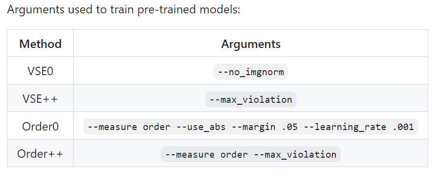
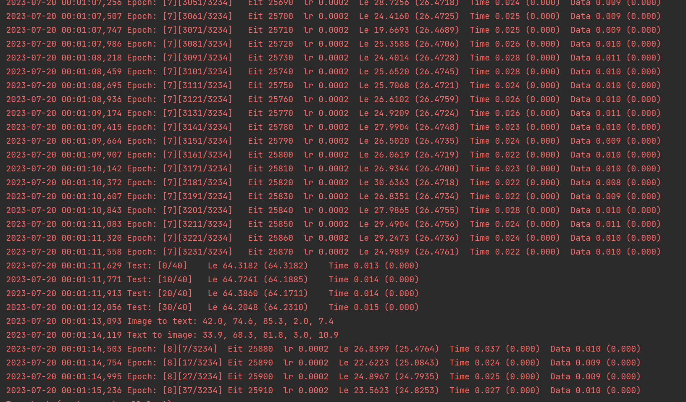

- [使用硬否定改进视觉语义嵌入](#使用硬否定改进视觉语义嵌入)
- [1.下载支持包](#1下载支持包)
- [2.下载数据](#2下载数据)
- [3.评估预训练模型](#3评估预训练模型)
  - [(1)运行结果](#1运行结果)
  - [(2)evaluation.py解释：](#2evaluationpy解释)
    - [①class AverageMeter和class LogCollector](#class-averagemeter和class-logcollector)
    - [②def encode\_data](#def-encode_data)
    - [③def evalrank](#def-evalrank)
    - [④def i2t](#def-i2t)
    - [⑤def t2i](#def-t2i)
- [4.Training new models](#4training-new-models)


### 使用硬否定改进视觉语义嵌入

[项目地址](https://github.com/fartashf/vsepp)

### 1.下载支持包
```python 
import nltk
nltk.download()
```
之后选择punkt下载

### 2.下载数据

```python 
wget http://www.cs.toronto.edu/~faghri/vsepp/vocab.tar
wget http://www.cs.toronto.edu/~faghri/vsepp/data.tar
wget http://www.cs.toronto.edu/~faghri/vsepp/runs.tar
```
 the path of extracted files for `data.tar` as `$DATA_PATH`

 files for `models.tar` as `$RUN_PATH`

 Extract `vocab.tar` to `./vocab` directory.

 Update: The vocabulary was originally built using all sets (including test set captions). Please see issue #29 for details. Please consider not using test set captions if building up on this project.

 ### 3.评估预训练模型

#### (1)运行结果
 ```python 
from vocab import Vocabulary
import evaluation
evaluation.evalrank('$RUN_PATH/coco_vse++/model_best.pth.tar', data_path='$DATA_PATH', split='test')
 ```

**output**
 ```python 
 Test: [0/40]	Le 63.6889 (63.6889)	Time 0.131 (0.000)	
Test: [10/40]	Le 63.4920 (65.4107)	Time 0.016 (0.000)	
Test: [20/40]	Le 62.3412 (64.8969)	Time 0.016 (0.000)	
Test: [30/40]	Le 65.4460 (65.0923)	Time 0.017 (0.000)	
Images: 1000, Captions: 5000
rsum: 386.7
Average i2t Recall: 67.7
Image to text: 43.7 74.8 84.6 2.0 8.8
Average t2i Recall: 61.2
Text to image: 33.8 68.8 81.0 3.0 12.9
 ```
- `Test: [0/40] Le 63.6889 (63.6889) Time 0.131 (0.000)`，这是每一个小批量（batch）的测试结果。`[0/40]`表示的是当前测试的批次，`Le 63.6889 (63.6889)`是模型在当前批次的损失（Loss）, `Time 0.131 (0.000)`表示的是这一批次的处理时间。

- `Images: 1000, Captions: 5000`，这表示在测试集中有1000个图片和5000个对应的标题

- `rsum: 386.7`这是对所有的召回率（Recall）进行求和的结果

- "`Average i2t Recall: 67.7`"，这表示的是从图像到文本（Image to Text, i2t）的平均召回率。即R@1, R@5 和 R@10 的平均值

- "`Image to text: 43.7 74.8 84.6 2.0 8.8`"，这分别代表的是从图像到文本（Image to Text, i2t）的R@1, R@5, R@10, Median Rank以及Mean Rank。

- "`Average t2i Recall: 61.2`"，这表示的是从文本到图像（Text to Image, t2i）的平均召回率。即R@1, R@5 和 R@10 的平均值

- "`Text to image: 33.8 68.8 81.0 3.0 12.9`"，这分别代表的是从文本到图像（Text to Image, t2i）的R@1, R@5, R@10, Median Rank以及Mean Rank。

**具体来说：**
- R@K 是一个常用的评估指标，表示的是在所有排序结果中，正确结果出现在前K个的概率。

- Median Rank 是正确结果在排序中的中位数排名。

- Mean Rank 是正确结果在排序中的平均排名。

要在MSCOCO上进行交叉验证，可以对使用——data_name coco训练的模型传递fold5=True

#### (2)evaluation.py解释：

##### ①class AverageMeter和class LogCollector

分别用于计算平均值和收集日志信息。这两个类主要被用于记录和显示训练过程中的指标，如loss和accuracy。

```python 
class AverageMeter(object):
    """Computes and stores the average and current value"""

    def __init__(self):
        self.reset()

    def reset(self):
        self.val = 0
        self.avg = 0
        self.sum = 0
        self.count = 0

    def update(self, val, n=0):
        self.val = val
        self.sum += val * n
        self.count += n
        self.avg = self.sum / (.0001 + self.count)

    def __str__(self):
        """String representation for logging
        """
        # for values that should be recorded exactly e.g. iteration number
        if self.count == 0:
            return str(self.val)
        # for stats
        return '%.4f (%.4f)' % (self.val, self.avg)


class LogCollector(object):
    """A collection of logging objects that can change from train to val"""

    def __init__(self):
        # to keep the order of logged variables deterministic
        self.meters = OrderedDict()

    def update(self, k, v, n=0):
        # create a new meter if previously not recorded
        if k not in self.meters:
            self.meters[k] = AverageMeter()
        self.meters[k].update(v, n)

    def __str__(self):
        """Concatenate the meters in one log line
        """
        s = ''
        for i, (k, v) in enumerate(self.meters.items()):
            if i > 0:
                s += '  '
            s += k + ' ' + str(v)
        return s

    def tb_log(self, tb_logger, prefix='', step=None):
        """Log using tensorboard
        """
        for k, v in self.meters.iteritems():
            tb_logger.log_value(prefix + k, v.val, step=step)
```

##### ②def encode_data

这个函数对输入的图像和文本数据进行编码。参数model是用于编码数据的模型，data_loader用于加载数据，log_step决定了每处理多少批次数据后打印一次日志，logging则决定了如何打印日志。

```python 
def encode_data(model, data_loader, log_step=10, logging=print):
    """Encode all images and captions loadable by `data_loader`
    """
    batch_time = AverageMeter()
    val_logger = LogCollector()

    # switch to evaluate mode
    model.val_start()

    end = time.time()

    # numpy array to keep all the embeddings
    img_embs = None
    cap_embs = None
    for i, (images, captions, lengths, ids) in enumerate(data_loader):
        # make sure val logger is used
        model.logger = val_logger

        # compute the embeddings
        img_emb, cap_emb = model.forward_emb(images, captions, lengths,
                                             volatile=True)

        # initialize the numpy arrays given the size of the embeddings
        if img_embs is None:
            img_embs = np.zeros((len(data_loader.dataset), img_emb.size(1)))
            cap_embs = np.zeros((len(data_loader.dataset), cap_emb.size(1)))

        # preserve the embeddings by copying from gpu and converting to numpy
        img_embs[ids] = img_emb.data.cpu().numpy().copy()
        cap_embs[ids] = cap_emb.data.cpu().numpy().copy()

        # measure accuracy and record loss
        model.forward_loss(img_emb, cap_emb)

        # measure elapsed time
        batch_time.update(time.time() - end)
        end = time.time()

        if i % log_step == 0:
            logging('Test: [{0}/{1}]\t'
                    '{e_log}\t'
                    'Time {batch_time.val:.3f} ({batch_time.avg:.3f})\t'
                    .format(
                        i, len(data_loader), batch_time=batch_time,
                        e_log=str(model.logger)))
        del images, captions

    return img_embs, cap_embs
```

##### ③def evalrank

此函数用于评估模型的性能。model_path是模型的路径，data_path是数据的路径，split决定了使用哪部分数据进行评估，fold5决定是否使用5折交叉验证。

```python 
def evalrank(model_path, data_path=None, split='dev', fold5=False):
    """
    Evaluate a trained model on either dev or test. If `fold5=True`, 5 fold
    cross-validation is done (only for MSCOCO). Otherwise, the full data is
    used for evaluation.
    """
    # load model and options
    checkpoint = torch.load(model_path)
    opt = checkpoint['opt']
    if data_path is not None:
        opt.data_path = data_path

    # load vocabulary used by the model
    with open(os.path.join(opt.vocab_path,
                           '%s_vocab.pkl' % opt.data_name), 'rb') as f:
        vocab = pickle.load(f)
    opt.vocab_size = len(vocab)

    # construct model
    model = VSE(opt)

    # load model state
    model.load_state_dict(checkpoint['model'])

    print('Loading dataset')
    data_loader = get_test_loader(split, opt.data_name, vocab, opt.crop_size,
                                  opt.batch_size, opt.workers, opt)

    print('Computing results...')
    img_embs, cap_embs = encode_data(model, data_loader)
    print('Images: %d, Captions: %d' %
          (img_embs.shape[0] / 5, cap_embs.shape[0]))

    if not fold5:
        # no cross-validation, full evaluation
        r, rt = i2t(img_embs, cap_embs, measure=opt.measure, return_ranks=True)
        ri, rti = t2i(img_embs, cap_embs,
                      measure=opt.measure, return_ranks=True)
        ar = (r[0] + r[1] + r[2]) / 3
        ari = (ri[0] + ri[1] + ri[2]) / 3
        rsum = r[0] + r[1] + r[2] + ri[0] + ri[1] + ri[2]
        print("rsum: %.1f" % rsum)
        print("Average i2t Recall: %.1f" % ar)
        print("Image to text: %.1f %.1f %.1f %.1f %.1f" % r)
        print("Average t2i Recall: %.1f" % ari)
        print("Text to image: %.1f %.1f %.1f %.1f %.1f" % ri)
    else:
        # 5fold cross-validation, only for MSCOCO
        results = []
        for i in range(5):
            r, rt0 = i2t(img_embs[i * 5000:(i + 1) * 5000],
                         cap_embs[i * 5000:(i + 1) *
                                  5000], measure=opt.measure,
                         return_ranks=True)
            print("Image to text: %.1f, %.1f, %.1f, %.1f, %.1f" % r)
            ri, rti0 = t2i(img_embs[i * 5000:(i + 1) * 5000],
                           cap_embs[i * 5000:(i + 1) *
                                    5000], measure=opt.measure,
                           return_ranks=True)
            if i == 0:
                rt, rti = rt0, rti0
            print("Text to image: %.1f, %.1f, %.1f, %.1f, %.1f" % ri)
            ar = (r[0] + r[1] + r[2]) / 3
            ari = (ri[0] + ri[1] + ri[2]) / 3
            rsum = r[0] + r[1] + r[2] + ri[0] + ri[1] + ri[2]
            print("rsum: %.1f ar: %.1f ari: %.1f" % (rsum, ar, ari))
            results += [list(r) + list(ri) + [rsum, ar, ari]]

        print("-----------------------------------")
        print("Mean metrics: ")
        mean_metrics = tuple(np.array(results).mean(axis=0).flatten())
        print("rsum: %.1f" % (mean_metrics[10] * 6))
        print("Average i2t Recall: %.1f" % mean_metrics[11])
        print("Image to text: %.1f %.1f %.1f %.1f %.1f" %
              mean_metrics[:5])
        print("Average t2i Recall: %.1f" % mean_metrics[12])
        print("Text to image: %.1f %.1f %.1f %.1f %.1f" %
              mean_metrics[5:10])

    torch.save({'rt': rt, 'rti': rti}, 'ranks.pth.tar')
```

在 evaluation.py 中，主要的评价结果被打印出来的部分是在 evalrank 函数中，特别是下面的代码段：
```python 
if not fold5:
    # no cross-validation, full evaluation
    r, rt = i2t(img_embs, cap_embs, measure=opt.measure, return_ranks=True)
    ri, rti = t2i(img_embs, cap_embs,
                  measure=opt.measure, return_ranks=True)
    ar = (r[0] + r[1] + r[2]) / 3
    ari = (ri[0] + ri[1] + ri[2]) / 3
    rsum = r[0] + r[1] + r[2] + ri[0] + ri[1] + ri[2]
    print("rsum: %.1f" % rsum)
    print("Average i2t Recall: %.1f" % ar)
    print("Image to text: %.1f %.1f %.1f %.1f %.1f" % r)
    print("Average t2i Recall: %.1f" % ari)
    print("Text to image: %.1f %.1f %.1f %.1f %.1f" % ri)

```

在这段代码中：

- `i2t` 是 Image-to-Text 的评价函数，它返回了一个五元组（R@1, R@5, R@10, Median Rank 和 Mean Rank）以及一个排名向量（这里没有用到）。这五元组中的每一个值都是对应的评价指标，具体地，R@k 表示真实文本在图像描述生成文本的排序中排在前 k 的概率；Median Rank 和 Mean Rank 则是真实文本在排序中的中位数排名和平均排名。

- `t2i` 是 Text-to-Image 的评价函数，它同样返回一个五元组和一个排名向量，这个五元组的含义和 i2t 的一样，只是评价的方向相反，从文本找图像。

- `ar` 是 Average i2t Recall，即 Image-to-Text 的平均召回率，取的是 R@1, R@5 和 R@10 的平均值。

- `ari` 是 Average t2i Recall，即 Text-to-Image 的平均召回率，取的是 R@1, R@5 和 R@10 的平均值。

- `rsum` 是所有这些评价指标的和，即 Image-to-Text 的 R@1, R@5, R@10 和 Text-to-Image 的 R@1, R@5, R@10 的总和。

- 如果 fold5 为True，代码中还包括一个交叉验证的评价过程，但这主要适用于 MSCOCO 数据集的评价，过程基本上和上面的类似，只是在五折的每一折上都进行了评价，最后对结果取平均。

##### ④def i2t

此函数用于图像到文本的检索任务，输入的images和captions分别表示图像和文本的嵌入，npts表示数据的数量，measure决定了如何计算图像和文本嵌入之间的相似度，return_ranks决定是否返回每个文本的排名。

```python 
def i2t(images, captions, npts=None, measure='cosine', return_ranks=False):
    """
    Images->Text (Image Annotation)
    Images: (5N, K) matrix of images
    Captions: (5N, K) matrix of captions
    """
    if npts is None:
        npts = int(images.shape[0] / 5)
    index_list = []

    ranks = numpy.zeros(npts)
    top1 = numpy.zeros(npts)
    for index in range(npts):

        # Get query image
        im = images[5 * index].reshape(1, images.shape[1])

        # Compute scores
        if measure == 'order':
            bs = 100
            if index % bs == 0:
                mx = min(images.shape[0], 5 * (index + bs))
                im2 = images[5 * index:mx:5]
                d2 = order_sim(torch.Tensor(im2).cuda(),
                               torch.Tensor(captions).cuda())
                d2 = d2.cpu().numpy()
            d = d2[index % bs]
        else:
            d = numpy.dot(im, captions.T).flatten()
        inds = numpy.argsort(d)[::-1]
        index_list.append(inds[0])

        # Score
        rank = 1e20
        for i in range(5 * index, 5 * index + 5, 1):
            tmp = numpy.where(inds == i)[0][0]
            if tmp < rank:
                rank = tmp
        ranks[index] = rank
        top1[index] = inds[0]

    # Compute metrics
    r1 = 100.0 * len(numpy.where(ranks < 1)[0]) / len(ranks)
    r5 = 100.0 * len(numpy.where(ranks < 5)[0]) / len(ranks)
    r10 = 100.0 * len(numpy.where(ranks < 10)[0]) / len(ranks)
    medr = numpy.floor(numpy.median(ranks)) + 1
    meanr = ranks.mean() + 1
    if return_ranks:
        return (r1, r5, r10, medr, meanr), (ranks, top1)
    else:
        return (r1, r5, r10, medr, meanr)
```

##### ⑤def t2i

此函数与i2t类似，但是用于文本到图像的检索任务。

```python 
def t2i(images, captions, npts=None, measure='cosine', return_ranks=False):
    """
    Text->Images (Image Search)
    Images: (5N, K) matrix of images
    Captions: (5N, K) matrix of captions
    """
    if npts is None:
        npts = int(images.shape[0] / 5)
    ims = numpy.array([images[i] for i in range(0, len(images), 5)])

    ranks = numpy.zeros(5 * npts)
    top1 = numpy.zeros(5 * npts)
    for index in range(npts):

        # Get query captions
        queries = captions[5 * index:5 * index + 5]

        # Compute scores
        if measure == 'order':
            bs = 100
            if 5 * index % bs == 0:
                mx = min(captions.shape[0], 5 * index + bs)
                q2 = captions[5 * index:mx]
                d2 = order_sim(torch.Tensor(ims).cuda(),
                               torch.Tensor(q2).cuda())
                d2 = d2.cpu().numpy()

            d = d2[:, (5 * index) % bs:(5 * index) % bs + 5].T
        else:
            d = numpy.dot(queries, ims.T)
        inds = numpy.zeros(d.shape)
        for i in range(len(inds)):
            inds[i] = numpy.argsort(d[i])[::-1]
            ranks[5 * index + i] = numpy.where(inds[i] == index)[0][0]
            top1[5 * index + i] = inds[i][0]

    # Compute metrics
    r1 = 100.0 * len(numpy.where(ranks < 1)[0]) / len(ranks)
    r5 = 100.0 * len(numpy.where(ranks < 5)[0]) / len(ranks)
    r10 = 100.0 * len(numpy.where(ranks < 10)[0]) / len(ranks)
    medr = numpy.floor(numpy.median(ranks)) + 1
    meanr = ranks.mean() + 1
    if return_ranks:
        return (r1, r5, r10, medr, meanr), (ranks, top1)
    else:
        return (r1, r5, r10, medr, meanr)
```

### 4.Training new models

Run `train.py`:
```python 
python train.py --data_path "$DATA_PATH" --data_name coco_precomp --logger_name 
runs/coco_vse++ --max_violation

```



结果
