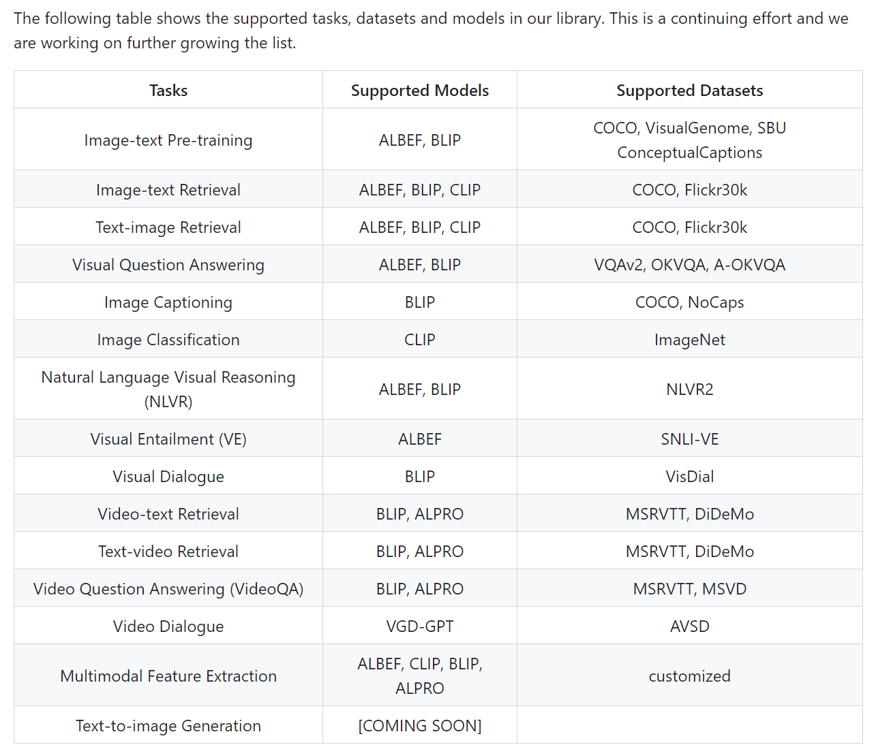
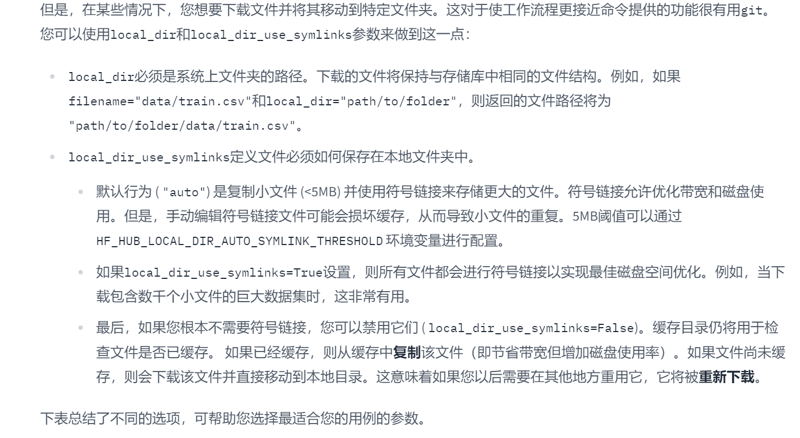
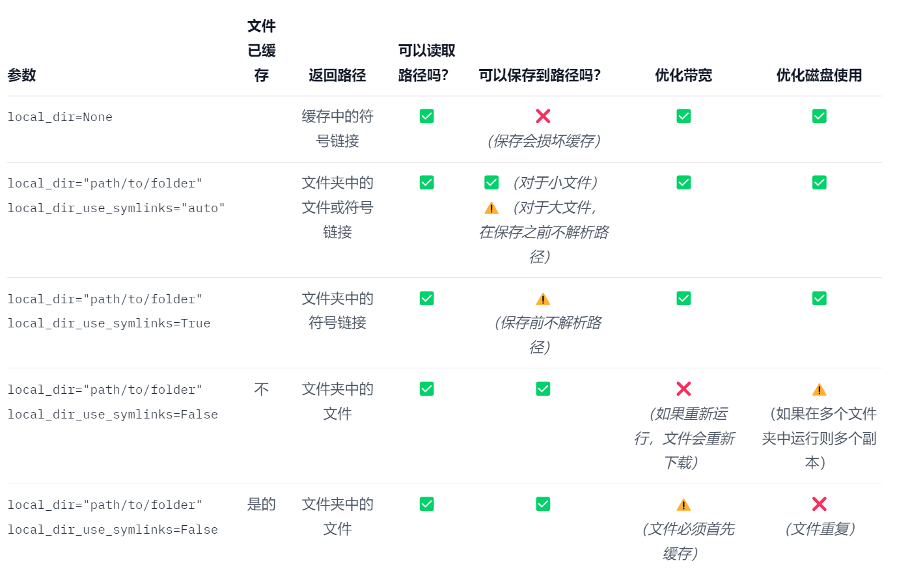

- [1.LAVIS 简介](#1lavis-简介)
- [2.Lavis常用代码语句](#2lavis常用代码语句)
  - [(1)库导入：](#1库导入)
  - [(2)设备选择：](#2设备选择)
  - [(3)图片加载：](#3图片加载)
  - [(4)模型加载:](#4模型加载)
  - [(5)图片预处理和文本预处理：](#5图片预处理和文本预处理)
  - [(6)生成结果:(不同模型不一样)](#6生成结果不同模型不一样)
- [3.image captioning 自动图像描述](#3image-captioning-自动图像描述)
- [4.Visual question answering (VQA)视觉问答](#4visual-question-answering-vqa视觉问答)
- [5.Unified Feature Extraction Interface统一特征提取接口](#5unified-feature-extraction-interface统一特征提取接口)
  - [(1)高维特征投影到低维特征](#1高维特征投影到低维特征)
- [6.Load Datasets加载数据集](#6load-datasets加载数据集)
- [7.BLIP2](#7blip2)
  - [(1)Image-to-text Generation Example](#1image-to-text-generation-example)
  - [(2)Feature Extraction Example](#2feature-extraction-example)
  - [(3)训练和评估模型](#3训练和评估模型)
    - [①训练和微调模型](#训练和微调模型)
    - [②评估微调后的模型](#评估微调后的模型)
    - [③配置文件](#配置文件)
- [8.huggingface](#8huggingface)
  - [(1)半精度（float16）](#1半精度float16)
  - [(2) int8](#2-int8)
  - [(3) BLIP2各种模型使用介绍及其method](#3-blip2各种模型使用介绍及其method)
  - [(4)模型下载](#4模型下载)
- [遇到的问题](#遇到的问题)


### 1.LAVIS 简介

LAVIS 是一个用于语言和视觉智能研究和应用的 Python 深度学习库。该库旨在为工程师和研究人员提供一站式解决方案，以快速开发适合其特定多模态场景的模型，并在标准和定制数据集上对其进行基准测试。它具有统一的界面设计来访问

10+任务（检索、字幕、视觉问答、多模态分类等）；
20 多个数据集（COCO、Flickr、Nocaps、Conceptual Commons、SBU 等）；
30 多个最先进的基础语言视觉模型的预训练权重及其特定于任务的适应，包括ALBEF、 BLIP、ALPRO、CLIP。

**支持的任务和模型**


**Model Zoo**
```python
from lavis.models import model_zoo
print(model_zoo)
# ==================================================
# Architectures                  Types
# ==================================================
# albef_classification           ve 
# albef_feature_extractor        base 
# albef_nlvr                     nlvr 
# albef_pretrain                 base
# albef_retrieval                coco, flickr 
# albef_vqa                      vqav2 
# alpro_qa                       msrvtt, msvd 
# alpro_retrieval                msrvtt, didemo
# blip_caption                   base_coco, large_coco
# blip_classification            base
# blip_feature_extractor         base
# blip_nlvr                      nlvr
# blip_pretrain                  base
# blip_retrieval                 coco, flickr
# blip_vqa                       vqav2, okvqa, aokvqa 
# clip_feature_extractor         ViT-B-32, ViT-B-16, ViT-L-14, ViT-L-14-336, RN50
# clip                           ViT-B-32, ViT-B-16, ViT-L-14, ViT-L-14-336, RN50
# gpt_dialogue                   base

# ve：视觉编码（Visual Encoding），用于将图像编码为向量表示的模型。
# base：基础模型，可能是用于预训练的通用模型或特征提取器。
# nlvr：用于自然语言视觉推理（Natural Language Visual Reasoning）任务的模型。
# coco：用于生成COCO数据集样式标注的模型。
# flickr：用于在Flickr数据集上进行图像检索的模型。
# vqav2：用于VQA v2数据集上回答问题的模型。
# msrvtt：用于在MSR-VTT数据集上回答问题或进行图像检索的模型。
# msvd：用于在MSVD数据集上回答问题或进行图像检索的模型。
# okvqa：用于在OK-VQA数据集上回答开放式问题的模型。
# aokvqa：用于在AOK-VQA数据集上回答开放式问题的模型。
# ViT-B-32:  它是基于Transformer的视觉模型，使用B级别的模型架构，并使用32x32像素的图像块作为输入。
# ViT-B-16: 类似于ViT-B-32，但使用16x16像素的图像块作为输入。
# ViT-L-14: 这是一个更大的视觉Transformer模型，使用L级别的模型架构，并使用14x14像素的图像块作为输入。
# ViT-L-14-336: 这个模型与ViT-L-14类似，但输入图像的分辨率为336x336像素。
# RN50：一个经典的卷积神经网络模型。它是一个具有50个卷积层的深层网络，广泛应用于计算机视觉任务中。

```

```python 
# ==================================================
# Architectures                  Types
# ==================================================
# blip2_opt                      pretrain_opt2.7b, caption_coco_opt2.7b, pretrain_opt6.7b, caption_coco_opt6.7b
# blip2_t5                       pretrain_flant5xl, caption_coco_flant5xl, pretrain_flant5xxl
# blip2                          pretrain, coco
```
使用pretrained_{LLM}模型类型通过提示进行零样本图像到文本生成。
使用caption_coco_{LLM}模型类型生成 coco 风格的标题。
使用blip2模型架构进行图像文本特征提取和检索。

<font color= red><font size= 4>注意：下载的模型默认保存在`C:\Users\29405\.cache\torch\hub\checkpoints`和`C:\Users\29405\.cache\torch\huggingface`</font>
</font>

后面手动更改为`E:\APP\study\pytorch\env\model`

### 2.Lavis常用代码语句

#### (1)库导入：
```python 
import torch
from PIL import Image
from lavis.models import load_model_and_preprocess
```

#### (2)设备选择：
`device = torch.device("cuda" if torch.cuda.is_available() else "cpu")`

#### (3)图片加载：
`raw_image = Image.open("image_path").convert("RGB")`

#### (4)模型加载:
```python 
model, vis_processors, txt_processors = load_model_and_preprocess(name="blip_caption", model_type="base_coco", is_eval=True, device=device)
# 加载预训练的BLIP Caption模型，并获取与图像处理相关的预处理器。
# name="blip_caption"指定加载BLIP Caption模型，
# model_type="base_coco"指定模型类型为基础版（base）的COCO标注版本（coco），
# is_eval=True表示将模型设置为评估模式，
# device=device指定计算设备。
```

#### (5)图片预处理和文本预处理：
```python 
# 图片预处理
image = vis_processors["eval"](raw_image).unsqueeze(0).to(device)
# 文本预处理
question = txt_processors["eval"](question)
# 使用预处理器对原始图像进行预处理。vis_processors存储了图像在"eval"模式下的预处理操作。
# vis_processors["eval"]表示获取"eval"模式下的预处理器，并将原始图像进行预处理。
# unsqueeze(0)将图像添加一个维度，以适应模型的输入要求.
# to(device)将图像移动到计算设备。
```

#### (6)生成结果:(不同模型不一样)
```python 
model.generate()

# blip_caption
model.generate({"image": image})

# blip_vqa
model.predict_answers(samples={"image": image, "text_input": question}, inference_method="generate")

# name="blip2_t5", model_type="pretrain_flant5xxl"
model.generate({"image": image, "prompt": "Question: which city is this? Answer:"})

            # 要求模型解释它的答案。
            model.generate({
                "image": image,
                "prompt": "Question: which city is this? Answer: singapore. Question: why?"})

            # 问一个后续问题。
            # prepare context prompt
            context = [
                ("which city is this?", "singapore"),
                ("why?", "it has a statue of a merlion"),
            ]
            question = "where is the name merlion coming from?"
            template = "Question: {} Answer: {}."
            prompt = " ".join([template.format(context[i][0], context[i][1]) for i in range(len(context))]) + " Question: " + question + " Answer:"
            # " ".join([template()])在每对question和answer中间加个空格
            # template.format(context[i][0], context[i][1]) for i in range(len(context)即把每个context中的question和answer按顺序按格式拼起来
            # 最后再加上新的question和answer
            print(prompt)
            # generate model's response
            model.generate({"image": image,"prompt": prompt})
            # 'merlion is a portmanteau of mermaid and lion'


```


### 3.image captioning 自动图像描述

```python 
import torch
from PIL import Image
from lavis.models import load_model_and_preprocess

# setup device to use
device = torch.device("cuda" if torch.cuda.is_available() else "cpu")
# load sample image
raw_image = Image.open("image/monash1.jpeg").convert("RGB")
# 加载预训练的BLIP Caption模型，并获取与图像处理相关的预处理器。
# name="blip_caption"指定加载BLIP Caption模型，
# model_type="base_coco"指定模型类型为基础版（base）的COCO标注版本（coco），
# is_eval=True表示将模型设置为评估模式，
# device=device指定计算设备。
model, vis_processors, _ = load_model_and_preprocess(name="blip_caption", model_type="base_coco", is_eval=True, device=device)
# preprocess the image
# vis_processors stores image transforms for "train" and "eval" (validation / testing / inference)
# 使用预处理器对原始图像进行预处理。vis_processors存储了图像在"eval"模式下的预处理操作。
# vis_processors["eval"]表示获取"eval"模式下的预处理器，并将原始图像进行预处理。
# unsqueeze(0)将图像添加一个维度，以适应模型的输入要求.
# to(device)将图像移动到计算设备。
image = vis_processors["eval"](raw_image).unsqueeze(0).to(device)
# generate caption
# 使用加载的模型对图像生成描述。model.generate()接受一个字典作为输入，字典中包含图像数据。在这里，将图像作为输入传递给模型生成描述。
print(model.generate({"image": image}))
# ['a large building with a grassy area in front of it']
```


### 4.Visual question answering (VQA)视觉问答

BLIP模型能够用自然语言回答关于图像的自由形式问题。要访问VQA模型，只需替换传递给`load_model_and_preprocess()`的名称和`model_type`参数。

```python 
import torch
from PIL import Image
from lavis.models import load_model_and_preprocess

# setup device to use
device = torch.device("cuda" if torch.cuda.is_available() else "cpu")
# load sample image
raw_image = Image.open("image/monash2.jpg").convert("RGB")
model, vis_processors, txt_processors = load_model_and_preprocess(name="blip_vqa", model_type="vqav2", is_eval=True, device=device)
# ask a random question.
question = "Which university is this photo taken at ?"
image = vis_processors["eval"](raw_image).unsqueeze(0).to(device)
question = txt_processors["eval"](question)
print(model.predict_answers(samples={"image": image, "text_input": question}, inference_method="generate"))
# ['university of california berkeley']
```


### 5.Unified Feature Extraction Interface统一特征提取接口

LAVIS提供了一个统一的接口来从每个体系结构中提取特性。为了提取特征，我们加载每个模型的特征提取器变体。多模态特征可用于多模态分类。低维单峰特征可用于计算跨模态相似度。

```python 
import torch
from PIL import Image
from lavis.models import load_model_and_preprocess

# setup device to use
device = torch.device("cuda" if torch.cuda.is_available() else "cpu")
# load sample image
raw_image = Image.open("image/monash2.jpg").convert("RGB")
# 加载特征提取模型和相应的预处理器
model, vis_processors, txt_processors = load_model_and_preprocess(name="blip_feature_extractor", model_type="base", is_eval=True, device=device)
# 文本
caption = "a large fountain spewing water into the air"
# 图片预处理
image = vis_processors["eval"](raw_image).unsqueeze(0).to(device)
# 文本预处理
text_input = txt_processors["eval"](caption)
# 创建一个样本字典sample，其中包含图像和文本输入。
# sample包含键值对："image"表示图像数据，"text_input"表示文本输入数据。
sample = {"image": image, "text_input": [text_input]}


# 调用model.extract_features(sample)来提取多模态特征
# 返回的features_multimodal是一个包含多模态特征的命名元组
features_multimodal = model.extract_features(sample)
# features_multimodal.multimodal_embeds可以访问多模态特征的张量表示形式
print(features_multimodal.multimodal_embeds.shape)
# torch.Size([1, 12, 768]), use features_multimodal[:,0,:] for multimodal classification tasks
# 这里的输出形状是torch.Size([1, 12, 768])。
# 如果需要进行多模态分类任务，可以使用features_multimodal[:,0,:]提取特定位置的特征。
# 即一共有12个位置的特征，可以通过指定第二个位置的值来提取特定位置的特征


# 通过传递参数mode="image"或mode="text"，可以分别提取图像特征或文本特征
features_image = model.extract_features(sample, mode="image")
features_text = model.extract_features(sample, mode="text")
print(features_image.image_embeds.shape)
# torch.Size([1, 197, 768]) 一共有197个图片特征
print(features_text.text_embeds.shape)
# torch.Size([1, 12, 768]) 一共有12个文本特征


# 此外，特征还可以通过投影到低维空间进行表示
# low-dimensional projected features
print(features_image.image_embeds_proj.shape)
# torch.Size([1, 197, 256])
print(features_text.text_embeds_proj.shape)
# torch.Size([1, 12, 256])
# 计算图像和文本特征的相似性，可以使用点积操作
similarity = features_image.image_embeds_proj[:,0,:] @ features_text.text_embeds_proj[:,0,:].t()
print(similarity)
# tensor([[0.2622]])
# 这里的输出是一个张量，表示图像和文本之间的相似性，输出为tensor([[0.2622]])
```

#### (1)高维特征投影到低维特征

在特征提取过程中，可以选择将高维特征投影到低维空间中，以减少特征的维度并提取更紧凑、更具代表性的特征表示。

在上述代码中，features_image.image_embeds_proj和features_text.text_embeds_proj表示经过投影的图像和文本特征。输出的形状分别为torch.Size([1, 197, 256])和torch.Size([1, 12, 256])。

这意味着通过投影操作，原始的图像特征和文本特征被映射到了一个低维空间，新的特征表示形式的维度为256。通过将特征投影到低维空间，可以降低特征的维度，减少计算复杂度，并且在某些情况下可以更好地捕捉数据的结构和关系。低维特征通常更适合进行后续的跨模态相似性计算或其他任务，如图像和文本的匹配或检索任务。


### 6.Load Datasets加载数据集

LAVIS 本质上支持各种常见的语言视觉数据集，通过[提供自动下载](https://opensource.salesforce.com/LAVIS//latest/benchmark)工具来帮助下载和组织这些数据集。下载后，要加载数据集，请使用以下代码：
```python 
from lavis.datasets.builders import dataset_zoo
dataset_names = dataset_zoo.get_names()
print(dataset_names)# 获取支持的数据集名称
# ['aok_vqa', 'coco_caption', 'coco_retrieval', 'coco_vqa', 'conceptual_caption_12m',
#  'conceptual_caption_3m', 'didemo_retrieval', 'flickr30k', 'imagenet', 'laion2B_multi',
#  'msrvtt_caption', 'msrvtt_qa', 'msrvtt_retrieval', 'msvd_caption', 'msvd_qa', 'nlvr',
#  'nocaps', 'ok_vqa', 'sbu_caption', 'snli_ve', 'vatex_caption', 'vg_caption', 'vg_vqa']
```

可以通过以下代码下载数据集：
`cd lavis/datasets/download_scripts/ && python download_coco.py`

This will automatically download and extract COCO images to the default LAVIS cache location. The default cache location is ~/.cache/lavis, defined in lavis/configs/default.yaml.


下载图像后，我们可以用来load_dataset()获取数据集。
```python 
from lavis.datasets.builders import load_dataset
coco_dataset = load_dataset("coco_caption") # 加载数据集
print(coco_dataset.keys()) # 返回一个包含训练集、验证集和测试集的字典
# dict_keys(['train', 'val', 'test'])
print(len(coco_dataset["train"]))
# 566747
print(coco_dataset["train"][0]) # 每个数据样本是一个字典，包含图像、文本输入和图像ID等信息。
# {'image': <PIL.Image.Image image mode=RGB size=640x480>,
#  'text_input': 'A woman wearing a net on her head cutting a cake. ',
#  'image_id': 0}
```

如果您已经托管数据集的本地副本，则可以传入参数vis_path来更改加载图像的默认位置。
```python 
coco_dataset = load_dataset("coco_caption", vis_path=YOUR_LOCAL_PATH)
```


### 7.BLIP2 

[这是BLIP-2论文](https://arxiv.org/abs/2301.12597)的正式实现，BLIP-2论文是一种通用且高效的预训练策略，可以轻松收获用于视觉语言预训练的预训练视觉模型和大语言模型（LLM）的开发。BLIP-2 在零样本 VQAv2 上击败了 Flamingo（65.0 vs 56.3），建立了零样本字幕的最新技术（NoCaps 121.6 CIDEr 得分 vs 之前最好的113.2）。BLIP-2 配备了强大的 LLM（例如 OPT、FlanT5），还为各种有趣的应用解锁了新的零样本指导视觉到语言生成功能！

#### (1)Image-to-text Generation Example

```python 
import torch
from PIL import Image
from lavis.models import load_model_and_preprocess

# setup device to use
device = torch.device("cuda") if torch.cuda.is_available() else "cpu"
# load sample image
raw_image = Image.open("../../docs/_static/merlion.png").convert("RGB")
display(raw_image.resize((596, 437)))

# loads BLIP-2 pre-trained model
model, vis_processors, _ = load_model_and_preprocess(name="blip2_t5", model_type="pretrain_flant5xxl", is_eval=True, device=device)
# prepare the image
image = vis_processors["eval"](raw_image).unsqueeze(0).to(device)

# Given the image and a text prompt, ask the model to generate the response.
model.generate({"image": image, "prompt": "Question: which city is this? Answer:"})
# 'singapore'

# Ask the model to explain its answer.
model.generate({
    "image": image,
    "prompt": "Question: which city is this? Answer: singapore. Question: why?"})
# 'it has a statue of a merlion'

# Ask a follow-up question.
# prepare context prompt
context = [
    ("which city is this?", "singapore"),
    ("why?", "it has a statue of a merlion"),
]
question = "where is the name merlion coming from?"
template = "Question: {} Answer: {}."
prompt = " ".join([template.format(context[i][0], context[i][1]) for i in range(len(context))]) + " Question: " + question + " Answer:"
print(prompt)
# generate model's response
model.generate({"image": image,"prompt": prompt})
# 'merlion is a portmanteau of mermaid and lion'

```

#### (2)Feature Extraction Example

```python 
import torch
from PIL import Image

from lavis.models import load_model_and_preprocess
from lavis.processors import load_processor

raw_image = Image.open("../docs/_static/merlion.png").convert("RGB")
display(raw_image.resize((596, 437)))
# setup device to use
device = torch.device("cuda") if torch.cuda.is_available() else "cpu"
caption = "merlion in Singapore"

model, vis_processors, text_processors = load_model_and_preprocess("blip2_image_text_matching", "pretrain", device=device, is_eval=True)
# model, vis_processors, text_processors = load_model_and_preprocess("blip2_image_text_matching", "coco", device=device, is_eval=True)
# 预处理
img = vis_processors["eval"](raw_image).unsqueeze(0).to(device)
txt = text_processors["eval"](caption)
```


- match_head="itm"参数指定了模型的匹配头部
- 匹配头部定义了模型在执行图像和文本匹配任务时所使用的特定头部。
- 在这种情况下，"itm"代表"Image-Text Matching"，即图像和文本的匹配任务。
- itm_output的形状为(batch_size, num_classes)
- batch_size 是输入数据的批量大小
- num_classes 是匹配任务的类别数量, 每个元素表示输入图像和文本匹配到对应类别的概率或得分。
- 在这个示例中，由于只有两个类别（匹配和不匹配），所以 itm_output 是一个形状为 (1, 2) 的张量。(大概)
- 可以通过应用 softmax 函数将概率分布归一化为概率，并使用 itm_scores = torch.nn.functional.softmax(itm_output, dim=1) 将其转换为概率表示。


```python
itm_output = model({"image": img, "text_input": txt}, match_head="itm")
```


```python
# 这段代码使用softmax()函数对模型输出进行处理，计算图像和文本匹配的概率。然后，使用item()方法获取匹配概率的数值，并使用:.3%格式化字符串打印结果。
itm_scores = torch.nn.functional.softmax(itm_output, dim=1)
print(f'The image and text are matched with a probability of {itm_scores[:, 1].item():.3%}')

# 这段代码计算图像特征和文本特征之间的余弦相似度。与之前相似，model()函数将图像和文本输入传递给模型，并使用match_head='itc'参数指定余弦相似度头部。
itc_score = model({"image": img, "text_input": txt}, match_head='itc')
print('The image feature and text feature has a cosine similarity of %.4f'%itc_score)
# 值越接近 1，表示相似度越高，值越接近 -1，表示相似度越低。
```


#### (3)训练和评估模型

##### ①训练和微调模型
第一阶段预训练（从头开始）： `bash run_scripts/blip2/train/pretrain_stage1.sh`

第 2 阶段预训练： `bash run_scripts/blip2/train/pretrain_stage2.sh`

微调图像字幕： `bash run_scripts/blip2/train/train_caption_coco.sh`

##### ②评估微调后的模型
通过运行`E:\APP\study\pytorch\LAVIS-main\LAVIS-main\run_scripts\blip2\eval`
下的sh文件来评估预训练和微调的模型。

在终端或命令行界面中运行。要运行这行代码，你需要打开终端或命令行界面，并进入到包含 pretrain_stage2.sh 脚本文件的目录中。然后使用 bash 命令运行该脚本。

##### ③配置文件
可以修改配置文件以进行定制培训。
文件在
`E:\APP\study\pytorch\LAVIS-main\LAVIS-main\lavis\projects\blip2\train`

要修改.yaml配置文件，你可以按照以下步骤进行操作：

- 找到要修改的.yaml配置文件。通常，配置文件的扩展名为.yaml或.yml。你可以使用文本编辑器（如Notepad++、Sublime Text、Visual Studio Code等）来打开该文件。

- 在打开的配置文件中，你可以找到各种参数和设置。每个参数通常由键值对组成，以冒号（:）分隔。例如：key: value。

- 根据你的需求，修改相应的参数值。确保按照配置文件的语法规则进行修改，例如正确缩进、正确的数据类型等。

- 保存修改后的配置文件。


### 8.huggingface

#### (1)半精度（float16）

```python 
from PIL import Image
import requests
from transformers import Blip2Processor, Blip2ForConditionalGeneration
import torch

device = "cuda" if torch.cuda.is_available() else "cpu"

# 创建 Blip2Processor 实例并加载预训练的模型参数：
# 其中这个路径"Salesforce/blip2-opt-2.7b"是你下载的模型所存放的路径
processor = Blip2Processor.from_pretrained("Salesforce/blip2-opt-2.7b")
# 创建 Blip2ForConditionalGeneration 实例并加载预训练的模型参数
model = Blip2ForConditionalGeneration.from_pretrained(
    "Salesforce/blip2-opt-2.7b", torch_dtype=torch.float16
)

将模型移动到指定的设备上（GPU或CPU）
model.to(device)
# 通过指定的URL获取图像数据，并使用 Image.open() 方法将其打开为 PIL.Image 对象：
url = "http://images.cocodataset.org/val2017/000000039769.jpg"
image = Image.open(requests.get(url, stream=True).raw)

# 使用 processor 对象对图像进行处理，并将其转换为模型可接受的输入形式。这里将输入数据转换为PyTorch张量，并将其移动到指定的设备上（GPU或CPU）
inputs = processor(images=image, return_tensors="pt").to(device, torch.float16)
# 注意，由于模型过大，可以选择不把它放到GPU上
# 所以相应地在生成inputs的时候，也不要放在GPU上或者使用16精度计算, 即不要.to(device, torch.float16)


# 使用模型的 generate 方法生成图像描述。这里传递了处理后的输入数据 inputs
generated_ids = model.generate(**inputs)
# 使用 processor 的 batch_decode 方法将生成的描述转换为可读的文本。skip_special_tokens=True 参数用于跳过特殊的标记（例如起始标记和结束标记）
generated_text = processor.batch_decode(generated_ids, skip_special_tokens=True)[0].strip()
print(generated_text)

# 然后来问它一个问题，比起caption，只需要对prompt进行tokenize：
prompt = "Question: xxx Answer:"
inputs = processor(images=image, text=prompt, return_tensors="pt") #.to(device, torch.float16)
# 注意这个时候的inputs.keys()包括了'pixel_values', 'input_ids', 'attention_mask'
inputs = processor(images=image, text=prompt, return_tensors="pt") #.to(device, torch.float16)
generated_ids = model.generate(**inputs)
generated_text = processor.batch_decode(generated_ids, skip_special_tokens=True)[0].strip()

print(generated_text)
# "xxx"

```

#### (2) int8

```python 
import torch
import requests
from PIL import Image
from transformers import Blip2Processor, Blip2ForConditionalGeneration

processor = Blip2Processor.from_pretrained("Salesforce/blip2-opt-2.7b")
model = Blip2ForConditionalGeneration.from_pretrained("Salesforce/blip2-opt-2.7b", load_in_8bit=True, device_map="auto")

img_url = 'https://storage.googleapis.com/sfr-vision-language-research/BLIP/demo.jpg' 
raw_image = Image.open(requests.get(img_url, stream=True).raw).convert('RGB')

question = "how many dogs are in the picture?"
inputs = processor(raw_image, question, return_tensors="pt").to("cuda", torch.float16)

out = model.generate(**inputs)
print(processor.decode(out[0], skip_special_tokens=True))
```


#### (3) BLIP2各种模型使用介绍及其method

[详情可看这里BLIP2](https://huggingface.co/docs/transformers/main/model_doc/blip-2#transformers.Blip2Processor)


#### (4)模型下载

[模型下载链接](https://huggingface.co/Salesforce?sort_models=downloads#models)

下载方法:
- 首先，安装Hugging Face的python API：`pip install huggingface_hub`
- 随后新建download.py，并输入：
```python 
from huggingface_hub import snapshot_download
snapshot_download(repo_id='Salesforce/blip2-opt-2.7b', repo_type= "dataset", cache_dir='E:\APP\study\pytorch\env\model\HUGGINGFACE_HUB_CACHE', local_dir='E:\APP\study\pytorch\env\model\HUGGINGFACE_HUB_DOWNLOAD')
```
可选参数: revision = 具体版本
local_dir_use_symlinks

local_dir 和 local_dir_use_symlinks地具体使用方法




我的repo_id = [model中的任意一个](https://huggingface.co/Salesforce?sort_models=downloads#models)
cache_dir = `E:\APP\study\pytorch\env\model\HUGGINGFACE_HUB_CACHE`
local_dir = `E:\APP\study\pytorch\env\model\HUGGINGFACE_HUB_DOWNLOAD`

- 部分文件类型的下载
```python 
from huggingface_hub import snapshot_download
snapshot_download(repo_id='your/target/repo', allow_patterns='*.json', cache_dir='local/path/you/want/to/save')
```

- 不允许下载部分类型的文件（以JSON为例）
```python 
from huggingface_hub import snapshot_download
snapshot_download(repo_id='your/target/repo', ignore_patterns=['*.json'], cache_dir='local/path/you/want/to/save')
```

### 遇到的问题


```python 
E:\APP\study\annaconda\envs\pytorch_py39\python.exe E:\pycharm_gc\pytorch\pytorch_test.py 
False

===================================BUG REPORT===================================
================================================================================
The following directories listed in your path were found to be non-existent: {WindowsPath('E')}
CUDA_SETUP: WARNING! libcudart.so not found in any environmental path. Searching in backup paths...
The following directories listed in your path were found to be non-existent: {WindowsPath('/usr/local/cuda/lib64')}
DEBUG: Possible options found for libcudart.so: set()
CUDA SETUP: PyTorch settings found: CUDA_VERSION=117, Highest Compute Capability: 8.6.
CUDA SETUP: To manually override the PyTorch CUDA version please see:https://github.com/TimDettmers/bitsandbytes/blob/main/how_to_use_nonpytorch_cuda.md
CUDA SETUP: Required library version not found: libbitsandbytes_cuda117.so. Maybe you need to compile it from source?
CUDA SETUP: Defaulting to libbitsandbytes_cpu.so...

================================================ERROR=====================================
CUDA SETUP: CUDA detection failed! Possible reasons:
1. You need to manually override the PyTorch CUDA version. Please see: "https://github.com/TimDettmers/bitsandbytes/blob/main/how_to_use_nonpytorch_cuda.md
2. CUDA driver not installed
3. CUDA not installed
4. You have multiple conflicting CUDA libraries
5. Required library not pre-compiled for this bitsandbytes release!
CUDA SETUP: If you compiled from source, try again with `make CUDA_VERSION=DETECTED_CUDA_VERSION` for example, `make CUDA_VERSION=113`.
CUDA SETUP: The CUDA version for the compile might depend on your conda install. Inspect CUDA version via `conda list | grep cuda`.
================================================================================

CUDA SETUP: Problem: The main issue seems to be that the main CUDA runtime library was not detected.
CUDA SETUP: Solution 1: To solve the issue the libcudart.so location needs to be added to the LD_LIBRARY_PATH variable
CUDA SETUP: Solution 1a): Find the cuda runtime library via: find / -name libcudart.so 2>/dev/null
CUDA SETUP: Solution 1b): Once the library is found add it to the LD_LIBRARY_PATH: export LD_LIBRARY_PATH=$LD_LIBRARY_PATH:FOUND_PATH_FROM_1a
CUDA SETUP: Solution 1c): For a permanent solution add the export from 1b into your .bashrc file, located at ~/.bashrc
CUDA SETUP: Solution 2: If no library was found in step 1a) you need to install CUDA.
CUDA SETUP: Solution 2a): Download CUDA install script: wget https://github.com/TimDettmers/bitsandbytes/blob/main/cuda_install.sh
CUDA SETUP: Solution 2b): Install desired CUDA version to desired location. The syntax is bash cuda_install.sh CUDA_VERSION PATH_TO_INSTALL_INTO.
CUDA SETUP: Solution 2b): For example, "bash cuda_install.sh 113 ~/local/" will download CUDA 11.3 and install into the folder ~/local
CUDA SETUP: Setup Failed!
E:\APP\study\annaconda\envs\pytorch_py39\lib\site-packages\bitsandbytes-0.40.2-py3.9.egg\bitsandbytes\cuda_setup\main.py:166: UserWarning: Welcome to bitsandbytes. For bug reports, please run

python -m bitsandbytes


  warn(msg)
E:\APP\study\annaconda\envs\pytorch_py39\lib\site-packages\bitsandbytes-0.40.2-py3.9.egg\bitsandbytes\cuda_setup\main.py:166: UserWarning: E:\APP\study\annaconda\envs\pytorch_py39 did not contain ['libcudart.so', 'libcudart.so.11.0', 'libcudart.so.12.0'] as expected! Searching further paths...
  warn(msg)
Traceback (most recent call last):
  File "E:\APP\study\annaconda\envs\pytorch_py39\lib\site-packages\transformers\utils\import_utils.py", line 1099, in _get_module
    return importlib.import_module("." + module_name, self.__name__)
  File "E:\APP\study\annaconda\envs\pytorch_py39\lib\importlib\__init__.py", line 127, in import_module
    return _bootstrap._gcd_import(name[level:], package, level)
  File "<frozen importlib._bootstrap>", line 1030, in _gcd_import
  File "<frozen importlib._bootstrap>", line 1007, in _find_and_load
  File "<frozen importlib._bootstrap>", line 986, in _find_and_load_unlocked
  File "<frozen importlib._bootstrap>", line 680, in _load_unlocked
  File "<frozen importlib._bootstrap_external>", line 850, in exec_module
  File "<frozen importlib._bootstrap>", line 228, in _call_with_frames_removed
  File "E:\APP\study\annaconda\envs\pytorch_py39\lib\site-packages\transformers\models\blip_2\modeling_blip_2.py", line 33, in <module>
    from ...modeling_utils import PreTrainedModel
  File "E:\APP\study\annaconda\envs\pytorch_py39\lib\site-packages\transformers\modeling_utils.py", line 86, in <module>
    from accelerate import dispatch_model, infer_auto_device_map, init_empty_weights
  File "E:\APP\study\annaconda\envs\pytorch_py39\lib\site-packages\accelerate\__init__.py", line 3, in <module>
    from .accelerator import Accelerator
  File "E:\APP\study\annaconda\envs\pytorch_py39\lib\site-packages\accelerate\accelerator.py", line 35, in <module>
    from .checkpointing import load_accelerator_state, load_custom_state, save_accelerator_state, save_custom_state
  File "E:\APP\study\annaconda\envs\pytorch_py39\lib\site-packages\accelerate\checkpointing.py", line 24, in <module>
    from .utils import (
  File "E:\APP\study\annaconda\envs\pytorch_py39\lib\site-packages\accelerate\utils\__init__.py", line 131, in <module>
    from .bnb import has_4bit_bnb_layers, load_and_quantize_model
  File "E:\APP\study\annaconda\envs\pytorch_py39\lib\site-packages\accelerate\utils\bnb.py", line 42, in <module>
    import bitsandbytes as bnb
  File "E:\APP\study\annaconda\envs\pytorch_py39\lib\site-packages\bitsandbytes-0.40.2-py3.9.egg\bitsandbytes\__init__.py", line 6, in <module>
    from . import cuda_setup, utils, research
  File "E:\APP\study\annaconda\envs\pytorch_py39\lib\site-packages\bitsandbytes-0.40.2-py3.9.egg\bitsandbytes\research\__init__.py", line 1, in <module>
    from . import nn
  File "E:\APP\study\annaconda\envs\pytorch_py39\lib\site-packages\bitsandbytes-0.40.2-py3.9.egg\bitsandbytes\research\nn\__init__.py", line 1, in <module>
    from .modules import LinearFP8Mixed, LinearFP8Global
  File "E:\APP\study\annaconda\envs\pytorch_py39\lib\site-packages\bitsandbytes-0.40.2-py3.9.egg\bitsandbytes\research\nn\modules.py", line 8, in <module>
    from bitsandbytes.optim import GlobalOptimManager
  File "E:\APP\study\annaconda\envs\pytorch_py39\lib\site-packages\bitsandbytes-0.40.2-py3.9.egg\bitsandbytes\optim\__init__.py", line 6, in <module>
    from bitsandbytes.cextension import COMPILED_WITH_CUDA
  File "E:\APP\study\annaconda\envs\pytorch_py39\lib\site-packages\bitsandbytes-0.40.2-py3.9.egg\bitsandbytes\cextension.py", line 20, in <module>
    raise RuntimeError('''
RuntimeError: 
        CUDA Setup failed despite GPU being available. Please run the following command to get more information:

        python -m bitsandbytes

        Inspect the output of the command and see if you can locate CUDA libraries. You might need to add them
        to your LD_LIBRARY_PATH. If you suspect a bug, please take the information from python -m bitsandbytes
        and open an issue at: https://github.com/TimDettmers/bitsandbytes/issues

The above exception was the direct cause of the following exception:

Traceback (most recent call last):
  File "E:\pycharm_gc\pytorch\pytorch_test.py", line 4, in <module>
    from transformers import Blip2Processor, Blip2ForConditionalGeneration
  File "<frozen importlib._bootstrap>", line 1055, in _handle_fromlist
  File "E:\APP\study\annaconda\envs\pytorch_py39\lib\site-packages\transformers\utils\import_utils.py", line 1090, in __getattr__
    value = getattr(module, name)
  File "E:\APP\study\annaconda\envs\pytorch_py39\lib\site-packages\transformers\utils\import_utils.py", line 1089, in __getattr__
    module = self._get_module(self._class_to_module[name])
  File "E:\APP\study\annaconda\envs\pytorch_py39\lib\site-packages\transformers\utils\import_utils.py", line 1101, in _get_module
    raise RuntimeError(
RuntimeError: Failed to import transformers.models.blip_2.modeling_blip_2 because of the following error (look up to see its traceback):

        CUDA Setup failed despite GPU being available. Please run the following command to get more information:

        python -m bitsandbytes

        Inspect the output of the command and see if you can locate CUDA libraries. You might need to add them
        to your LD_LIBRARY_PATH. If you suspect a bug, please take the information from python -m bitsandbytes
        and open an issue at: https://github.com/TimDettmers/bitsandbytes/issues

Process finished with exit code 1

```

```python 
#如果使用了conda一定注意先卸载掉bitsandbytes
pip uninstall bitsandbytes
#明明科学上网了,但我这边没有git成功，可以下包到本地再解压
git clone https://github.com/TimDettmers/bitsandbytes.git 
cd bitsandbytes
make CUDA_VERSION=122 #注意替换为当前的CUDA_VERSION
python setup.py install

出现的报错：
nvcc fatal   : Cannot find compiler 'cl.exe' in PATH
```

